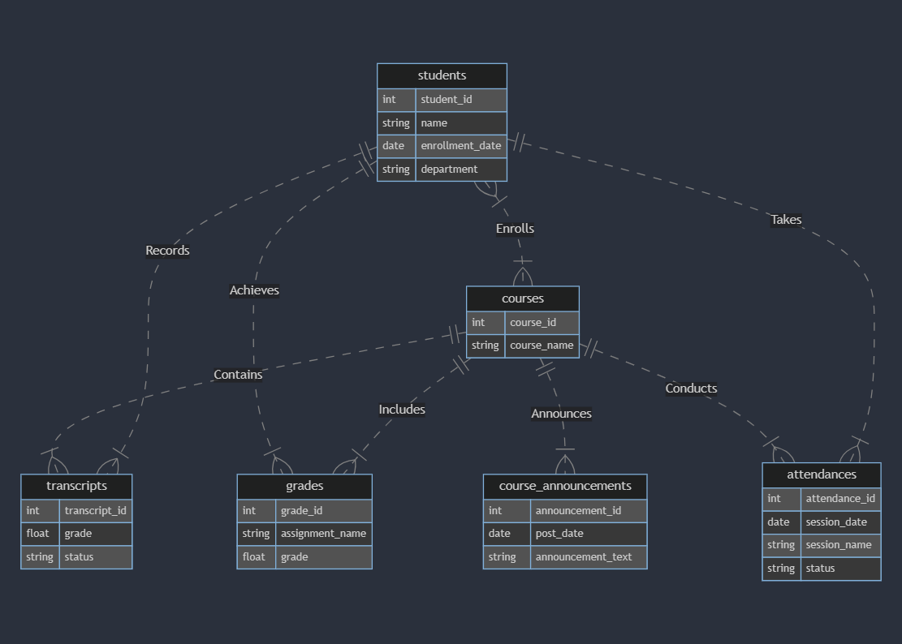

# Education-Managment-System

## Scope

- What is the purpose of your database?
  The purpose of the database is to manage and organize information related to a fictional educational institution.
  It includes data about students, courses, enrollments, transcripts, grades, attendances and course announcements.
- Which people, places, things, etc. are you including in the scope of your database?

* **Students:** Information about students, including name, enrollment date, and department.
* **Courses:** Details about courses, such as the course name.
* **Enrollments:** Relationships between students and courses.
* **Transcripts:** Student grades and completion status for each course.
* **Grades:** Specific grades for assignments within courses.
* **Attendances:** Records of students' attendance in various sessions.
* **Course Announcements:** Important announcements related to each course.

- Which people, places, things, etc. are _outside_ the scope of your database?

* Financial data or transactions (e.g., tuition fees, financial aid).
* Employee information not directly related to the educational process.

## Functional Requirements

- What should a user be able to do with your database?
  Users should be able to:

* Retrieve information about students, courses, grades, attendances, and announcements.
* View transcripts and grades for individual students.
* Check attendance records for sessions.
* Receive announcements for specific courses.
* Obtain average grades for courses and students.

- What's beyond the scope of what a user should be able to do with your database?
  Financial transactions, administrative tasks (e.g., payroll), and non-educational institutional functions are beyond the scope.

## Representation

### Entities

In this section you should answer the following questions:

- Which entities will you choose to represent in your database?

In our database, we represent the following entities:

- **Students**
- **Courses**
- **Enrollment**
- **Transcripts**
- **Grades**
- **Attendances**
- **Course Announcements**

* What attributes will those entities have?

### Students

- `student_id` (INTEGER)
- `name` (TEXT)
- `enrollment_date` (NUMERIC)
- `department` (TEXT)

### Courses

- `course_id` (INTEGER)
- `course_name` (TEXT)

### Enrollment

- `student_id` (INTEGER)
- `course_id` (INTEGER)

### Transcripts

- `transcript_id` (INTEGER)
- `grade` (NUMERIC)
- `status` (TEXT)
- `student_id` (INTEGER)
- `course_id` (INTEGER)

### Grades

- `grade_id` (INTEGER)
- `grade` (NUMERIC)
- `assignment_name` (TEXT)
- `student_id` (INTEGER)
- `course_id` (INTEGER)

### Attendances

- `attendance_id` (INTEGER)
- `session_name` (TEXT)
- `session_date` (NUMERIC)
- `status` (TEXT)
- `student_id` (INTEGER)
- `course_id` (INTEGER)

### Course Announcements

- `announcement_id` (INTEGER)
- `post_date` (NUMERIC)
- `announcement_text` (TEXT)
- `course_id` (INTEGER)

* Why did you choose the types you did?

We chose the following types and constraints based on the nature of the data:

- INTEGER: Used for unique identifiers and numerical values.
- TEXT: Suitable for storing alphanumeric data like names and text.
- NUMERIC: Chosen for date and grade attributes to handle numeric and date values efficiently.

* Why did you choose the constraints you did?
  We chose the following constraints based on the nature of the data and to ensure data integrity:

- **PRIMARY KEY Constraints:**

  - Applied to attributes that uniquely identify records within each table.
  - Example: `student_id` in the Students table, `course_id` in the Courses table.

- **FOREIGN KEY Constraints:**

  - Used to establish relationships between tables.
  - Ensures referential integrity by linking the foreign key in one table to the primary key in another.
  - Examples: `student_id` and `course_id` in the Enrollment, Transcripts, Grades, and Attendances tables.

- **CHECK Constraints:**

  - Implemented to restrict the values that can be inserted into a column.
  - Example: `status` in the Transcripts and Attendances tables has a CHECK constraint to ensure only specified values ('completed' or 'ongoing' for status) are allowed.

- **DEFAULT Constraints:**
  - Employed to provide default values for a column when no value is specified during an INSERT operation.
  - Example: `enrollment_date` in the Students table has a DEFAULT constraint set to the current timestamp.

These constraints collectively contribute to maintaining data accuracy, integrity, and relationships across different tables in the database.

### Relationships

In this section you should include your entity relationship diagram and describe the relationships between the entities in your database.

- Students and Courses: Many-to-many relationship through Enrollments.
- Students and Transcripts: One-to-many relationship.
- Courses and Transcripts: One-to-many relationship.
- Courses and Grades: One-to-many relationship.
- Students and Attendances: One-to-many relationship through Attendances.
- Courses and Course Announcements: One-to-many relationship.

## Optimizations

- Which optimizations (e.g., indexes, views) did you create? Why?

### Indexes

- Index on "search_by_course_name" in the "courses" table for efficient course name searches.
- Index on "search_by_student_name" in the "students" table for quick student name lookups.
- Index on "search_by_transcripts_status" in the "transcripts" table for speedy status-based searches.
- Index on "search_by_attendances_status" in the "attendances" table for optimized status-based queries.

### Views

- "attendance_summary_view" for summarizing attendance status of students.
- "average_grade_for_students" for calculating the average grade for each student.
- "average_grade_for_courses" for determining the average grade for each course.
- "student_grades_view" for combining student and grade information.
- "enrolled_students_view" for listing enrolled students in each course.
- "course_announcements_view" for viewing course announcements.

## Limitations

In this section you should answer the following questions:

- What are the limitations of your design?

* Real-time data updates may not be instantaneous.
* Advanced reporting and analytics may require additional tools.
* Integration with external systems requires further considerations.
* Concurrent transactions in large-scale scenarios might affect performance.
* Scalability challenges may arise with a growing data volume.

- What might your database not be able to represent very well?

* The database might struggle to represent complex financial transactions effectively.
* Historical data tracking is not implemented, limiting the ability to analyze changes over time.
* Real-time data updates may not be instantaneous, affecting applications requiring live updates.
* Robust user authentication and authorization features are not in place, posing security limitations.
* Integration with external systems may need further considerations, impacting interoperability.

